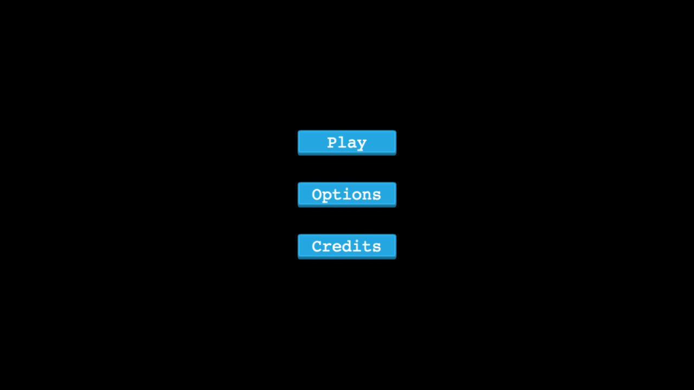

# JS-MazeRunner

## Description

This is an infinite runner game made with phaserJS and compiled with Webpack. Testing is done with jestJS. The name of the game was inspired by a movie of the same name. The Maze Runner is a 2014 American dystopian science fiction film directed by Wes Ball, in his directorial debut, based on James Dashner's 2009 novel of the same name. Don't look for a maze in this game though, you won't find one! Haha...

The aim of the game is to collect as many gold pieces as possible in sixty seconds while avoiding falling into the flames.
All gold pieces can be found on platforms which you can jump up to by hitting the "W" button - Player can jump once, twice, or thrice consecutively.

More gold pieces are found on the highest platforms, so the player is encouraged to spend as much time as possible running and jumping on the high-up platforms and is penalized in lost earnings if they fall to the ground.

## Game Development

> **_Explain what your initial objectives for the project were (at the end of the day 2) and which ones you did (or did not) achieve and why_**

### Initial Aims

In the Game Design Document I created on the second day of this 5-day project, I laid out an "Emotional Experience" which described how I would like the player to feel. To paraphrase from that section and others from the same document:

1. The player feels **engaged**, consistently **interested**, but **never stressed**.
2. The game is not predictable or boring, but neither does it punish the player arbitrarily. The player is **rewarded for skill** and for paying close attention to the **dependable rules and physics** of the game.
3. The design prioritises consistency and attractiveness over complexity/realism.
4. The sound of the game is not just a repetitive feature that becomes irritating. All sounds and music must contribute positively to the gameplay and experience of the game.
5. The game does not emphasise changes in surface-level appearance that only serve to distract the player from the game itself. Players don't enjoy being needlessly distracted by features which are irrelevant to the gameplay.

### Game Design

An endless runner game, where a player hops from platform to platform collecting coins for as long as:
- The player does not fall off the platform.
- The player does not enter the flames.

--- Movement
The player can only jump two times.
Press the 'W' key twice to double jump.

-- Scores
The player can increase his score by collecting coins.

--- Game Over
The total number of coins collected.
An Input field to collect player names and save the player score.

-- Future additions

In the future, I will try to add more coins with varying values.
I will also try to add game speed to increase difficulty.

### Local Setup

## Prerequisites

Since the game's dependencies are managed by [npm](https://www.npmjs.com/), you must have **node.js** installed on your computer before following these set-up instructions. If you don't yet have node.js installed, you can choose a download method [here](https://nodejs.org/en/download/).

## Setup Instructions

To set this project up locally, follow these simple instructions:

1. Open a Terminal and navigate to the location in your system where you would like to download the project. **New to Terminal? [Learn here](https://www.freecodecamp.org/news/conquering-the-command-line-f85f5e46c07c/).**

2. Enter the following line of code to clone this repository:

`git clone git@github.com:udberg/Maze-Runner.git`

3. Now that the repository has been cloned, navigate inside it using `cd Maze-Runner`.

4. The project's dependencies are managed by npm. The details of this project's dependencies can be found in `package.json` To install them, enter the following line of code in the Terminal.

`npm install`

5. Congratulations! All necessary files have been installed. To view the website, you can use the project's preconfigured npm script. Simply enter: `npm run start`. (This will bundle all relevant code into a single `build/bundle.min.js` file and then set up a local server to run the index.html file).

## Library Directory 📙

| Contents                    |
| --------------------------- |

| [Live Demo](#live-demo)     |
| [Screenshot](#screenshot)   |
| [Built With](#built-with-🛠) |
| [Contributing](#contributing🛠) |
| [Testing](#testing🛠) |
| [Authors](#authors)         |
| [License](#license)         |

## Live Demo

[Live demo](https://zealous-einstein-2fa834.netlify.app)

 ## Screenshot

## Built With 🛠

- JavaScript
- [PhaserJS](https://phaser.io/)
- [npm](https://www.npmjs.com/) with [webpack](https://webpack.js.org/)
- Linted with [ESLint](https://eslint.org/)
- Tested with [Jest](https://jestjs.io/)

## Contributing

- Fork the project
- Create your feature branch `git checkout -b awesome-feature`
- Commit your changes `git commit -m 'Awesome feature'`
- Push it `git push -u origin awesome-feature`
- Open a pull request using this branch

## Testing

This project's tests were created with [Jest](https://jestjs.io/). Once the project's dependencies have been installed (see Setup Instructions above), Jest will be available. **However**, the Jest Command Line Interface is only available if Jest is intalled globally:

1. Run `npm install jest --global` to make Jest globally available.

Once again, the project includes a handy script to run those tests for you:

2. Now you can run `npm run test` or simply `jest` to run the project's tests.

## Authors

### 👨‍💻 Uduak John

  
  
  

### 🤝 Contributing

Contributions, issues and feature requests are welcome!

Feel free to check the [issues page]().

### Show your support

Give a ⭐️ if you like this project!

### License

